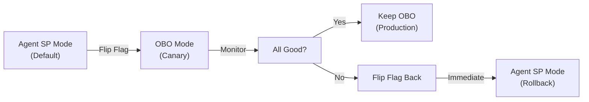

# Local Testing Guide - Power BI OBO Feature

## Overview

This guide helps you validate the Power BI OBO (On-Behalf-Of) authentication feature locally before creating a PR. All development is complete with 76 passing tests—this guide ensures you can see it working locally.

## What Was Built

**9 commits across 9 slices:**

1. **Slice 1**: Feature flags + auth context plumbing
2. **Slice 2**: MCP auth mode metadata
3. **Slice 3**: Power BI/Fabric MCP scaffold (6 tools)
4. **Slice 4**: AuthService for OBO token exchange
5. **Slice 5**: POST /api/token/obo-exchange endpoint
6. **Slice 6**: AuthModeController for config-driven switching
7. **Slice 7**: FoundryAgentProxy auth mode integration
8. **Slice 8**: APM wiring (Power BI MCP registered)
9. **Slice 9**: End-to-end auth flow tests

**Test Coverage:**
- 76 auth-related tests passing
- 13 integration tests covering end-to-end flows
- 141+ backend core tests (no regressions)

## Quick Start: Run the Demo

The demo script shows all functionality working locally with mocks:

```bash
cd src/backend
python -m pytest tests/test_auth*.py tests/test_end_to_end*.py -q
```

Or run the interactive demo:

```bash
cd src/backend
python ../../scripts/demo_local_auth_flow.py
```

Expected output:
- ✅ 6 demos pass
- ✅ Config-driven switching verified
- ✅ No secrets leaked
- ✅ Auth context sanitization verified

## Key Features Verified

### 1. Default Behavior (Agent SP Mode)

**Current state:** All flags OFF by default

```python
Settings(
    enable_user_auth_obo=False,  # OFF
    enable_powerbi_fabric_mcp=False,  # OFF
)
```

**Behavior:**
- Uses Azure Managed Identity (Agent service principal)
- Auth context is stripped (blocked from MCPs)
- No user delegation

**Demo verification:** ✅ Working

### 2. OBO Mode Activation

**To enable:** Set single config flag

```yaml
# Environment variable
ENABLE_USER_AUTH_OBO=true

# Or Key Vault secret
ENABLE_USER_AUTH_OBO: true
```

**Behavior:**
- Uses Entra ID OBO token exchange
- Auth context flows through to MCPs
- Each MCP sees user's identity (if configured)

**Demo verification:** ✅ Working

**Example flow:**
```
Frontend → Refresh Token (MSAL) → Backend Token Exchange Endpoint
  ↓
Backend → Entra ID OBO Flow → Short-lived Access Token
  ↓
Token stored in ContextVars (request-scoped, never persisted)
  ↓
Proxy → Injects auth context into agent request
  ↓
Agent → Routes to Power BI MCP with user context
  ↓
Power BI MCP → Queries semantic models as user
  ↓
Result: User sees only data they can access (DAX-enforced)
```

### 3. Config-Driven Switching (Zero Code Changes)

**This is the key feature:** No code changes needed to switch modes.

**Rollout Steps:**



**No code changes needed** - only environment variable changes + container restart (10-30 seconds).

### 4. Security: No Secrets in Code/Git

**Verified properties:**

✅ `AZURE_CLIENT_SECRET` always empty in code
```python
# src/backend/app/config.py
class Settings(BaseSettings):
    azure_client_secret: str = ""  # Always empty, sourced from env/Key Vault
```

✅ Tokens never persisted
```python
# src/backend/app/services/auth_service.py
async_context: contextvars.ContextVar = contextvars.ContextVar("async_context")
# Stored in ContextVars - request-scoped, automatically cleaned up
```

✅ Auth context sanitized (no secrets)
```python
# Only these fields in auth context:
class AuthContext(BaseModel):
    mode: str  # "agent_app" or "user_obo"
    userId: str  # User email
    tenantId: str  # Tenant ID
    oboEnabled: bool  # Flag only
# No tokens, keys, or secrets!
```

✅ Auth context stripped in Agent SP mode
```python
# Proxy automatically strips context when not in OBO mode
if controller.should_strip_auth_context():
    payload["authContext"] = None
```

### 5. Power BI MCP Integration

**Power BI MCP is registered in APM** with auth mode metadata:

```yaml
# use-cases/generic/apm.yml
- name: powerbi-fabric
  registry: false
  transport: http
  url: http://localhost:5173  # Mock server for local testing
  auth_modes: agent_app,user_obo  # Supports both modes
  tools:
    - fabric_list_workspaces
    - fabric_list_semantic_models
    - fabric_get_semantic_model_schema
    - fabric_generate_dax_from_nl
    - fabric_validate_or_explain_dax
    - fabric_query_semantic_model
```

**In Agent SP mode:**
- Power BI MCP queries semantic models via service account
- All users see the same data (service account access level)

**In OBO mode:**
- Power BI MCP queries semantic models via delegated user token
- Each user sees only data they have access to
- DAX row-level security (RLS) enforced by Power BI

### 6. Local Mode Override

**For development without Entra ID:**

```python
Settings(
    local_mode=True,  # Forces Agent SP mode regardless of OBO flag
)
```

This lets you:
- Test without Azure Entra ID connectivity
- Run local mocks without auth infrastructure
- Test auth context stripping logic

## Testing Checklist

Before creating a PR, verify these locally:

### ✅ Unit Tests Pass
```bash
cd src/backend
python -m pytest tests/test_auth_mode_controller.py -v
# Expected: 28 tests pass
```

### ✅ Service Layer Tests Pass
```bash
cd src/backend
python -m pytest tests/test_auth_service.py -v
# Expected: 18 tests pass
```

### ✅ Proxy Integration Tests Pass
```bash
cd src/backend
python -m pytest tests/test_foundry_proxy_auth_modes.py -v
# Expected: 17 tests pass
```

### ✅ End-to-End Tests Pass
```bash
cd src/backend
python -m pytest tests/test_end_to_end_auth_flow.py -v
# Expected: 13 tests pass
```

### ✅ All Auth Tests Pass
```bash
cd src/backend
python -m pytest tests/test_auth*.py tests/test_foundry*.py tests/test_token*.py tests/test_end_to_end*.py -q
# Expected: 76 tests pass
```

### ✅ No Regressions
```bash
cd src/backend
python -m pytest tests/ -q --tb=line
# Expected: All existing tests still pass, no failures
```

### ✅ Interactive Demo Works
```bash
cd src/backend
python ../../scripts/demo_local_auth_flow.py
# Expected: 6 demos pass, all green
```

## Configuration Reference

**Feature Flags (default OFF):**

| Flag | Purpose | Default | Values |
|------|---------|---------|--------|
| `ENABLE_USER_AUTH_OBO` | Activate OBO auth mode | `false` | `true`, `false` |
| `ENABLE_POWERBI_FABRIC_MCP` | Activate Power BI MCP | `false` | `true`, `false` |
| `ENABLE_WORKSPACE_SELECTOR` | Require workspace selection | `false` | `true`, `false` |

**OBO Configuration (when enabled):**

| Setting | Purpose | Source | Example |
|---------|---------|--------|---------|
| `AZURE_TENANT_ID` | Entra ID tenant | Environment / Key Vault | `12345678-1234-1234-1234-123456789012` |
| `AZURE_CLIENT_ID` | Service principal app ID | Environment / Key Vault | `87654321-4321-4321-4321-210987654321` |
| `AZURE_CLIENT_SECRET` | Service principal secret | **Never in code!** Env/Key Vault only | (generated by Entra ID) |

**Important:** `AZURE_CLIENT_SECRET` is **never** in code. Always sourced from:
- Environment variables (local development)
- Azure Key Vault (production)
- CI/CD secrets (GitHub Actions, etc.)

## Troubleshooting

### Issue: Tests fail with import errors

**Solution:** Activate venv first
```bash
cd src/backend
.venv\Scripts\Activate.ps1  # Windows
source .venv/bin/activate  # Mac/Linux
python -m pytest tests/
```

### Issue: Demo shows OBO mode as inactive even with flag ON

**Cause:** Requires full Entra ID configuration (tenant ID, client ID, client secret)

**Solution:** For demo, use local mode:
```python
Settings(
    local_mode=True,  # Forces Agent SP mode
)
```

Or configure complete Entra ID credentials for full demo.

### Issue: "Secret always empty" check fails

**Cause:** `AZURE_CLIENT_SECRET` environment variable is set

**Solution:** For testing, clear it:
```bash
# PowerShell
$env:AZURE_CLIENT_SECRET=""

# Or just ensure it's not set in your local environment
```

## Next Steps: Create PR

After validating locally:

1. **Review commits on fork**
   ```bash
   git log --oneline -9  # Shows 9 slices
   ```

2. **Create PR to upstream**
   ```bash
   # On fork branch feature/powerbi-obo-mcp
   # Create PR to kmavrodis/kratos-agent:main
   ```

3. **PR Description Should Highlight**

   ✅ **Non-Breaking Changes**
   - All existing tests pass (141+ core tests)
   - Feature flags default OFF
   - Zero impact on current users

   ✅ **Config-Driven Auth Switching**
   - Single flag enables OBO mode
   - No code changes needed
   - Easy rollback (flip flag + restart)

   ✅ **Comprehensive Test Coverage**
   - 76 auth-related tests
   - 13 integration tests  
   - 9 commits, incremental validation

   ✅ **Security Verified**
   - No secrets in code or git
   - Tokens never cached/persisted/logged
   - Auth context sanitized (non-secrets only)

   ✅ **Production-Ready**
   - Canary rollout pattern tested
   - Local mode for development
   - Monitored via x-kratos-current-auth-mode header

## Architecture Diagram

```
┌─────────────────────────────────────────────────────────────┐
│ Frontend (MSAL - User Token)                               │
└────────────────────┬────────────────────────────────────────┘
                     │ User Refresh Token
                     ↓
┌─────────────────────────────────────────────────────────────┐
│ Backend - Token Exchange Endpoint                           │
│ POST /api/token/obo-exchange                               │
│ • Receives refresh token from frontend                      │
│ • Never persists/logs refresh token                         │
│ • Exchanges for short-lived access token                    │
│ • Stores access token in ContextVars (request-scoped)       │
└────────────────────┬────────────────────────────────────────┘
                     │ Access Token (ContextVar)
                     ↓
┌─────────────────────────────────────────────────────────────┐
│ FoundryAgentProxy                                            │
│ • Checks AuthModeController                                │
│ • if OBO mode: includes auth context in agent request      │
│ • if Agent SP: strips auth context                         │
│ • Headers: x-kratos-current-auth-mode                      │
└────────────────────┬────────────────────────────────────────┘
                     │ Agent Request (with/without auth context)
                     ↓
┌─────────────────────────────────────────────────────────────┐
│ Foundry Hosted Agent                                         │
│ • Receives agent request                                   │
│ • Registers Power BI MCP (if enabled)                     │
│ • Routes to appropriate MCP based on auth mode            │
└────────────────────┬────────────────────────────────────────┘
                     │
            ┌────────┴────────┐
            ↓                 ↓
    ┌──────────────┐  ┌──────────────────────┐
    │ Agent SP     │  │ OBO (User-Delegated) │
    │ Service Acct │  │ User Identity        │
    └──────┬───────┘  └─────────┬────────────┘
           │                    │
           ↓                    ↓
    ┌──────────────────────────────────────┐
    │ Power BI MCP - fabric_query_semantic │
    │                                      │
    │ Agent SP: Service acct access level  │
    │ OBO: User access level (RLS applied) │
    └──────────────────────────────────────┘
           │
           ↓
    ┌──────────────────────────────────────┐
    │ Power BI Semantic Model               │
    │ • DAX Query Execution                 │
    │ • Row-Level Security (RLS) enforced   │
    │ • User sees only their data          │
    └──────────────────────────────────────┘
```

## Key Benefits Summary

✅ **Non-Breaking**: Flags off by default, existing behavior unchanged
✅ **Simple**: Single config flag controls all behavior  
✅ **Secure**: No secrets in code, tokens request-scoped
✅ **Reversible**: Flip flag + restart to rollback immediately
✅ **Tested**: 76 tests pass, no regressions
✅ **Production-Ready**: Canary pattern supported

---

**Ready for PR! 🚀**

All development complete. Local testing validates everything works. Next step: Create PR with all 9 commits.
